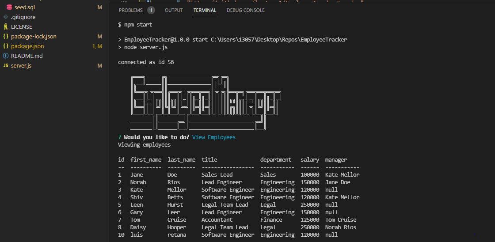

# Employee Tracker
MIT licence
    
## Description
Command line prompt tat allows user to keep track of employees, roles, departments. Employees are able to be added with desired departments and roles and are also able to be removed when necessary. 
[project link](https://github.com/lretana1/EmployeeTracker)

## Table Of Contents
* [Installation](#user-content-installation)
* [Usage](#user-content-usage)
* [Licenses](#user-content-licenses)
* [Tests](#user-content-tests)
* [Questions](#user-content-questions)
    
## Installation
1. install npm init -y to create a new .json file
2. npm i
3. npm i inquirer
4. npm i mysql
5. npm i console.table
6. make sure to run .sql file in mySQL workbench before running server.js so that tables are able to render correctly
7. run node server.js
8. make sure server.js is connected to SQL before continuing
9. run through prompts as required 

## Usage
download files and run npm start

[how to video](https://watch.screencastify.com/v/Zbo3aHpOoeRlZEjVSHY7)
## Screenshot

## License
MIT licence
    
## Contributing
No further contributions are necessary at this time
 
## Tests
manual test only

## Questions
for any questions please check out my GitHub profile: [Lretana1](https://github.com/lretana1)  
